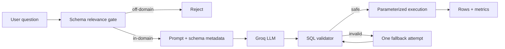

# Text2SQL Agent — ERP

[](https://github.com/guisefe/text2sql-agent/actions/workflows/ci.yml)


A **guardrailed Text-to-SQL agent** that turns natural-language questions about ERP data into validated, read-only SQL and executes only the statements allowed by a deterministic safety layer.

The project is intentionally small enough to understand end to end: the LLM proposes SQL, application code validates the action, SQLAlchemy executes it, and the agent can make one controlled retry when the proposal fails.

> This is a portfolio/demo system, not a production database gateway. The limitations and production gaps are documented explicitly.

## Why this is useful

Giving an LLM direct database access is unsafe. A useful Text-to-SQL system needs more than a prompt:

- a bounded business schema;
- deterministic validation outside the model;
- protection against write/DDL statements and unknown identifiers;
- controlled failure/retry behavior;
- execution metrics and testable contracts.

This repository focuses on those engineering boundaries rather than on building a generic chatbot UI.

## Agent flow



### What makes it agentic?

It is a **single-purpose, bounded agentic workflow**, not a general autonomous agent. It receives a goal, uses an LLM for the probabilistic generation step, validates the proposed action, executes an allowed tool (SQL), observes failure, and can self-correct once. The loop is deliberately bounded for safety and predictable latency.

## Safety contract

The model is never trusted to decide whether its SQL may run.

The validator currently allows only:

- one `SELECT` statement;
- one table from the approved schema;
- known columns and allowlisted functions;
- safe literals and supported read-only clauses.

It rejects, among other cases:

- `INSERT`, `UPDATE`, `DELETE`, `DROP`, `ALTER`, `CREATE`;
- multiple statements and SQL comments;
- unknown tables/columns;
- `UNION`, JOINs and subqueries;
- dangerous SQLite-specific operations/functions included in the deny checks.

String literals are then converted to SQLAlchemy bind parameters before execution.

## Demo domain

The included SQLite database models a small commercial ERP module:

| Table | Purpose |
|---|---|
| `clientes` | customer registry, location, segment and active status |
| `produtos` | product/service catalog, price and stock |
| `pedidos` | order value, quantity, status and date |

Model-facing descriptions live in `app/database/schema.json`; executable DDL and seed data live in `app/database/schema.sql`.

## Quick start

### 1. Install

```bash
git clone https://github.com/guisefe/text2sql-agent.git
cd text2sql-agent
python -m venv .venv
source .venv/bin/activate   # Windows: .venv\Scripts\activate
python -m pip install -r requirements.txt
```

### 2. Configure Groq

```bash
cp .env.example .env
```

Set your key in `.env`:

```text
GROQ_API_KEY=your_key_here
GROQ_MODEL=llama-3.1-8b-instant
```

The API can start without a key so `/health` remains available, but `/query` will return HTTP 503 until the LLM is configured.

### 3. Run

```bash
uvicorn app.main:app --host 0.0.0.0 --port 8000 --reload
```

Open the interactive API documentation at `http://localhost:8000/docs`.

## Three-query live demo

### Successful query

```json
{
  "query": "Liste os clientes ativos"
}
```

### Aggregation

```json
{
  "query": "Qual o valor total dos pedidos aprovados?"
}
```

### Off-domain rejection

```json
{
  "query": "Qual a capital do Brasil?"
}
```

The third request is rejected before the LLM call because the question does not reference the bounded ERP schema.

## API

| Method | Endpoint | Purpose |
|---|---|---|
| `POST` | `/query` | generate, validate and execute read-only SQL |
| `GET` | `/schema` | inspect the metadata supplied to the agent |
| `GET` | `/health` | liveness plus model/configuration status |

A successful `/query` response includes the generated SQL, result rows, row count, cache state, LLM latency, SQL latency and total latency.

## Engineering structure

```text
app/
├── main.py                 API orchestration and bounded retry
├── config.py               environment configuration
├── database/
│   ├── connection.py       SQLAlchemy engine + demo initialization
│   ├── schema.json         model-facing schema metadata
│   └── schema.sql          SQLite DDL + seed data
├── models/                 request/response contracts
├── services/
│   ├── llm_service.py      Groq boundary + cache
│   ├── prompt_builder.py   schema-aware few-shot prompt
│   └── sql_executor.py     validation + parameterized execution
└── validators/
    └── sql_validator.py    deterministic SQL safety policy

tests/                      unit + API integration tests
```

## Quality

CI runs on **Python 3.11 and 3.12** and performs:

```bash
ruff check app tests
pytest -v --cov=app --cov-report=term-missing --cov-fail-under=85
```

The current demo baseline has **54 automated tests** and maintains an **85% minimum application coverage gate**.

## Docker

```bash
docker compose up --build
```

The container exposes port `8000` and includes a `/health` healthcheck.

## Intentional limitations

- one-table SQL only; JOINs are outside the current validation contract;
- SQLite demo storage;
- no authentication/authorization yet;
- in-memory rate limiting;
- one hosted LLM provider;
- lexical schema-relevance gate rather than a learned classifier;
- no request-level distributed tracing or cost telemetry.

These are treated as engineering boundaries, not hidden behind production claims. See [Technical Documentation](TECHNICAL_DOCUMENTATION.md) and [Design Decisions](DECISIONS.md) for the rationale and production evolution path.

## License

MIT © Guilherme Senis Fernandes
