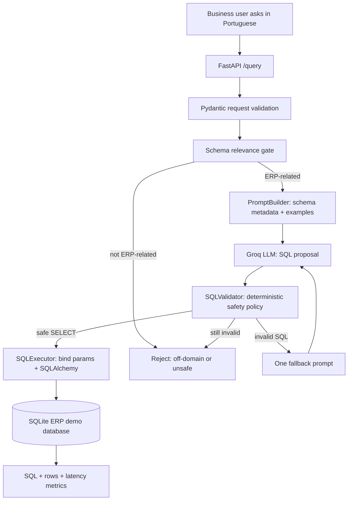
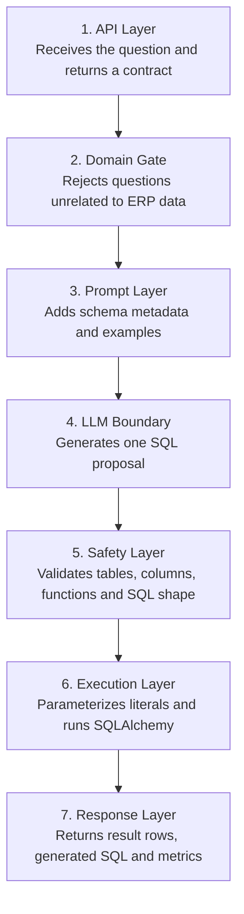
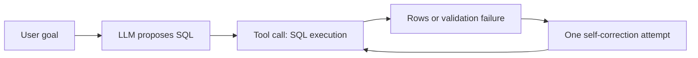

# Text2SQL Agent — ERP

[](https://github.com/guisefe/text2sql-agent/actions/workflows/ci.yml)


[](docs/interview-mini-deck.md)


A **guardrailed Text-to-SQL agent** that lets a user ask questions about ERP data in plain Portuguese and returns database answers through validated, read-only SQL.

The important idea is simple:

> The LLM is allowed to **propose** SQL. The application decides whether that SQL is safe enough to run.

This project is intentionally small enough to understand in one interview, but realistic enough to discuss LLM safety, tool use, validation, fallback, API contracts, testing and production evolution.

## Engineering evidence at a glance

The project treats Text-to-SQL as a controlled backend workflow, not a free-form database chatbot.

| Engineering concern | Evidence in the implementation |
| --- | --- |
| **Least privilege** | The database path accepts only a validated, single read-only `SELECT`. |
| **AI bounded by policy** | Schema relevance gate, SQL allowlists/denylists and one corrective retry limit model autonomy. |
| **Safe execution boundary** | SQLAlchemy execution and bind parameters keep generated SQL away from direct unrestricted execution. |
| **Inspectable behavior** | API contracts return generated SQL, result metadata and latency information for each accepted request. |
| **Regression protection** | Automated unit/API tests, Ruff and a coverage gate run in CI on Python 3.11 and 3.12. |

The central engineering question is: **can a model propose a useful query without becoming an untrusted database operator?**

### 🎤 Interview presentation

Want the project in presentation form instead of reading the full repository?

**[Open the 6-slide interview deck →](docs/interview-mini-deck.md)**

It covers the problem, product idea, cascading architecture, guardrails, live demo and production evolution in roughly **5 minutes**.

---

## 30-second explanation

Many business users need answers from databases but do not know SQL.

A risky solution would be: send the database schema to an LLM and execute whatever it returns.

This project takes a safer approach:

1. the user asks a question;
2. the system checks whether the question belongs to the ERP domain;
3. the LLM generates a SQL proposal;
4. a deterministic validator checks the SQL;
5. only validated `SELECT` queries are executed;
6. the API returns rows, generated SQL and timing metrics.

If the generated SQL is invalid, the agent gets **one bounded retry**. If it still fails, the system refuses instead of forcing an unsafe answer.

---

## What this project demonstrates

| Capability | How it appears in this project |
|---|---|
| LLM application design | the model is used only for the probabilistic Text-to-SQL step |
| Agentic workflow | goal → proposed action → tool validation → execution → bounded retry |
| Backend engineering | FastAPI contracts, configuration, services and clear module boundaries |
| SQL safety | deterministic validation before execution |
| Guardrails | off-domain rejection, allowlists, blocked SQL patterns and parameterization |
| Testing discipline | unit and API integration tests with CI and coverage gate |
| Interview storytelling | clear demo path with success, aggregation and rejection cases |

---

## Architecture in one picture



---

## Cascading architecture

The project is designed as a simple cascade so that each layer has one job:



This separation makes the interview explanation easier:

- **LLM layer:** handles language understanding.
- **Safety layer:** decides what is allowed.
- **Execution layer:** touches the database.
- **Response layer:** exposes the result and observability data.

---

## Why this is agentic, but bounded

This is not a fully autonomous multi-agent system. That is deliberate.

It is a **single-purpose bounded agentic workflow**:



The loop is intentionally limited to keep the system predictable in cost, latency and behavior.

---

## Safety contract

The model is never trusted to decide whether its SQL may run.

The validator currently allows only:

- one `SELECT` statement;
- one table from the approved schema;
- known columns and allowlisted functions;
- safe literals and supported read-only clauses.

It rejects, among other cases:

- `INSERT`, `UPDATE`, `DELETE`, `DROP`, `ALTER`, `CREATE`;
- multiple statements and SQL comments;
- unknown tables/columns;
- `UNION`, JOINs and subqueries;
- dangerous SQLite-specific operations/functions included in the deny checks.

String literals are then converted to SQLAlchemy bind parameters before execution.

A good way to summarize the design:

> Prompting is guidance. Validation is enforcement.

---

## Demo domain

The included SQLite database models a small commercial ERP module:

| Table | Purpose | Example questions |
|---|---|---|
| `clientes` | customer registry, location, segment and active status | “Liste os clientes ativos” |
| `produtos` | product/service catalog, price and stock | “Qual o produto mais caro?” |
| `pedidos` | order value, quantity, status and date | “Qual o valor total dos pedidos aprovados?” |

Model-facing descriptions live in `app/database/schema.json`; executable DDL and seed data live in `app/database/schema.sql`.

---

## Live demo script

Use these three requests in the interview.

### 1. Happy path

```json
{
  "query": "Liste os clientes ativos"
}
```

What to show:

- schema gate accepts the ERP question;
- LLM generates SQL;
- validator approves;
- executor returns rows.

### 2. Aggregation

```json
{
  "query": "Qual o valor total dos pedidos aprovados?"
}
```

What to show:

- the model maps natural language to `SUM(valor_total)`;
- the response includes SQL, rows and latency metrics.

### 3. Guardrail

```json
{
  "query": "Qual a capital do Brasil?"
}
```

What to show:

- the system refuses before calling the LLM;
- the project demonstrates safe failure, not only successful generation.

---

## Quick start

### 1. Install

```bash
git clone https://github.com/guisefe/text2sql-agent.git
cd text2sql-agent
python -m venv .venv
source .venv/bin/activate   # Windows: .venv\Scripts\activate
python -m pip install -r requirements.txt
```

### 2. Configure Groq

```bash
cp .env.example .env
```

Set your key in `.env`:

```text
GROQ_API_KEY=your_key_here
GROQ_MODEL=llama-3.1-8b-instant
```

The API can start without a key so `/health` remains available, but `/query` will return HTTP 503 until the LLM is configured.

### 3. Run

```bash
uvicorn app.main:app --host 0.0.0.0 --port 8000 --reload
```

Open the interactive API documentation at `http://localhost:8000/docs`.

---

## API

| Method | Endpoint | Purpose |
|---|---|---|
| `POST` | `/query` | generate, validate and execute read-only SQL |
| `GET` | `/schema` | inspect the metadata supplied to the agent |
| `GET` | `/health` | liveness plus model/configuration status |

A successful `/query` response includes:

- generated SQL;
- result rows;
- row count;
- cache state;
- LLM latency;
- SQL execution latency;
- total request latency.

---

## Engineering structure

```text
app/
├── main.py                 API orchestration and bounded retry
├── config.py               environment configuration
├── database/
│   ├── connection.py       SQLAlchemy engine + demo initialization
│   ├── schema.json         model-facing schema metadata
│   └── schema.sql          SQLite DDL + seed data
├── models/                 request/response contracts
├── services/
│   ├── llm_service.py      Groq boundary + cache
│   ├── prompt_builder.py   schema-aware few-shot prompt
│   └── sql_executor.py     validation + parameterized execution
└── validators/
    └── sql_validator.py    deterministic SQL safety policy

tests/                      unit + API integration tests
```

---

## Quality

CI runs on **Python 3.11 and 3.12** and performs:

```bash
ruff check app tests
pytest -v --cov=app --cov-report=term-missing --cov-fail-under=85
```

The current demo baseline has **54 automated tests** and maintains an **85% minimum application coverage gate**.

---

## Docker

```bash
docker compose up --build
```

The container exposes port `8000` and includes a `/health` healthcheck.

---

## Intentional limitations

This is a bounded demo, not a production database gateway.

| Current limitation | Production evolution |
|---|---|
| one-table SQL only | relationship metadata, JOIN policy and stronger AST validation |
| SQLite demo storage | PostgreSQL read replica and read-only database role |
| no authentication/authorization | JWT/API key auth, RBAC and tenant isolation |
| lexical schema gate | domain classifier or embedding-based table selection |
| one LLM provider | provider interface with fallback and cost routing |
| basic metrics | request tracing, token cost, accuracy evals and dashboards |

These are treated as engineering boundaries, not hidden behind production claims. See [Technical Documentation](TECHNICAL_DOCUMENTATION.md), [Design Decisions](DECISIONS.md), [Architecture Notes](docs/architecture.md) and [Interview Mini Deck](docs/interview-mini-deck.md) for the rationale and presentation path.

---

## License

MIT © Guilherme Senis Fernandes
