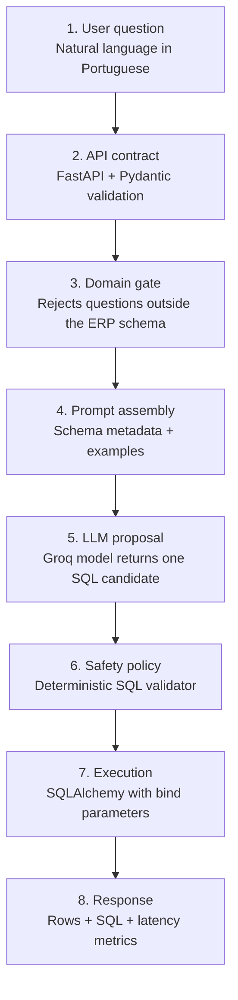
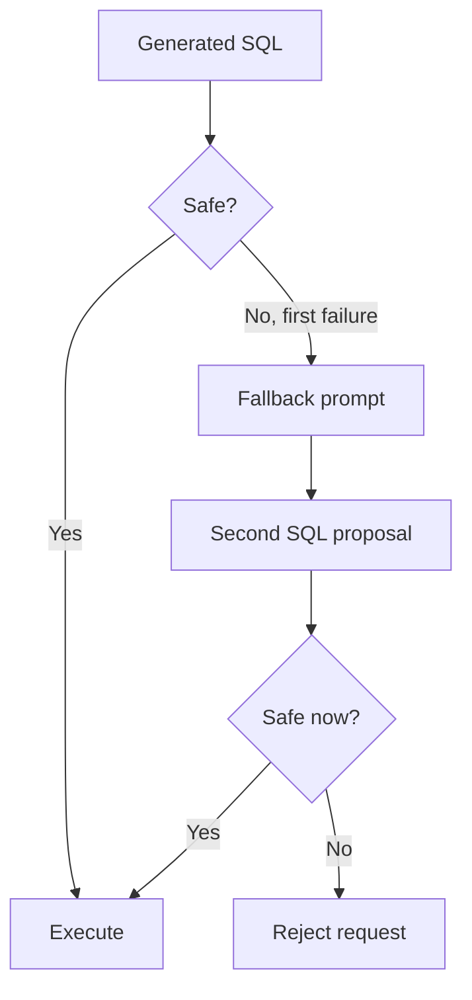
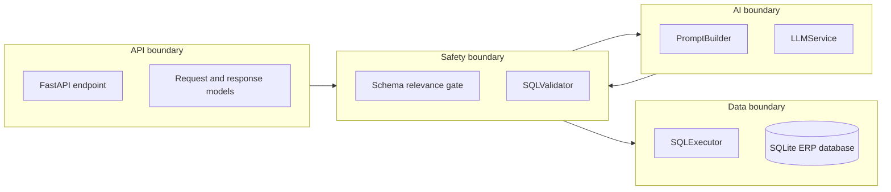

# Architecture Notes

This document explains the project in a way that is easy to present to recruiters, technical interviewers and non-specialists.

## The plain-language version

The project lets a person ask questions about ERP data without writing SQL.

Instead of giving the language model full control over the database, the system separates responsibilities:

- the **LLM** interprets the question and proposes SQL;
- the **application** validates whether the SQL is safe;
- the **database executor** only runs approved read-only statements.

The core design principle is:

> Treat LLM output as untrusted input.

## Cascading architecture

## Failure cascade

The retry loop is limited to one attempt. This keeps the workflow predictable and prevents uncontrolled agent loops.

## Runtime boundaries

## Why not let the LLM execute directly?

Because prompts are not enforcement mechanisms.

A model may ignore instructions, hallucinate a column, generate unsafe SQL or produce syntax that does not match the current schema. The project therefore keeps the database tool behind a deterministic validation layer.

## What is intentionally out of scope?

| Limitation | Why it is deferred | Production path |
|---|---|---|
| No JOINs | keeps validator simple and explainable | add relationship metadata and AST-level policy |
| SQLite | zero setup for demo | PostgreSQL read replica and read-only role |
| Lexical domain gate | easy to understand | classifier or embedding-based schema/table retrieval |
| Single LLM provider | demo simplicity | provider abstraction, fallback and cost routing |
| No authentication | not needed for local demo | JWT/API key middleware, RBAC and tenant isolation |

## Interview explanation

A strong explanation is:

> This is a bounded agentic workflow. The model proposes a database action, but deterministic application code validates the action before execution. If the action is invalid, the agent can retry once. If it still fails, the system refuses instead of forcing an unsafe answer.
